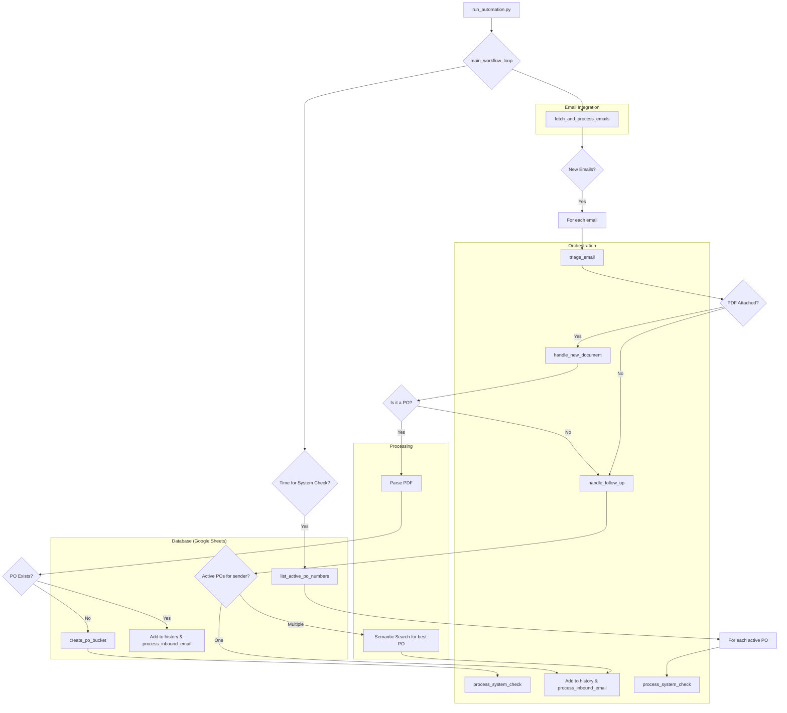

```mermaid
graph TD
    A[run_automation.py] --> B{main_workflow_loop};
    B --> C[fetch_and_process_emails];
    C --> D{New Emails?};
    D -- Yes --> E[For each email];
    E --> F[triage_email];
    F --> G{PDF Attached?};
    G -- Yes --> H[handle_new_document];
    H --> I{Is it a PO?};
    I -- Yes --> J[Parse PDF];
    J --> K{PO Exists?};
    K -- No --> L[create_po_bucket];
    L --> M[process_system_check];
    K -- Yes --> N[Add to history & process_inbound_email];
    I -- No --> O[handle_follow_up];
    G -- No --> O;
    O --> P{Active POs for sender?};
    P -- One --> Q[Add to history & process_inbound_email];
    P -- Multiple --> R[Semantic Search for best PO];
    R --> Q;
    B --> S{Time for System Check?};
    S -- Yes --> T[list_active_po_numbers];
    T --> U[For each active PO];
    U --> V[process_system_check];

    subgraph "Email Integration"
        C
    end

    subgraph "Orchestration"
        F
        H
        O
        M
        V
        Q
    end

    subgraph "Database (Google Sheets)"
        L
        N
        P
        T
    end

    subgraph "Processing"
        J
        R
    end
```
